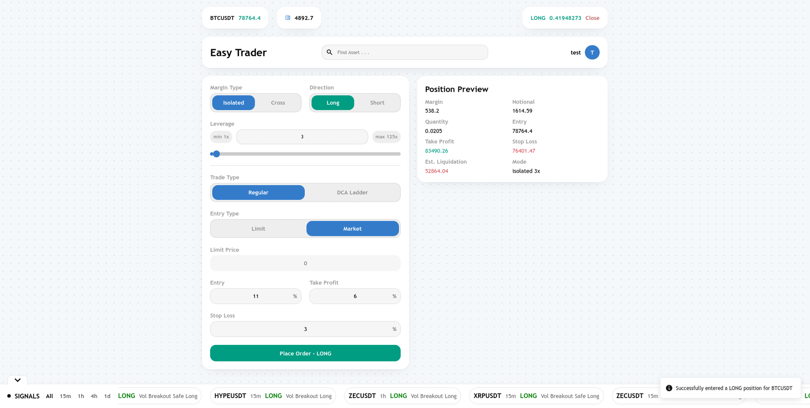
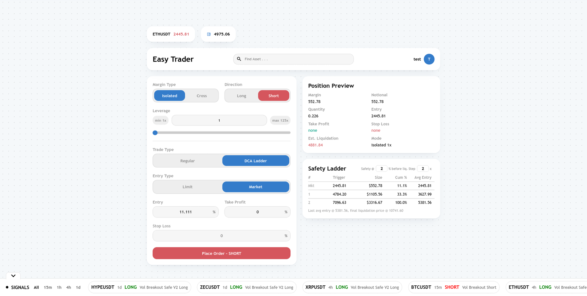
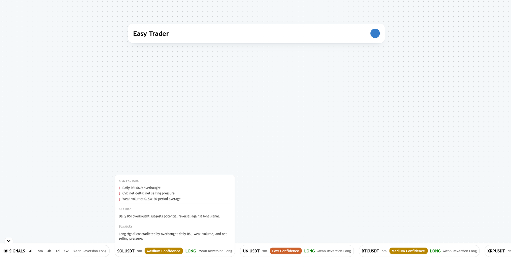
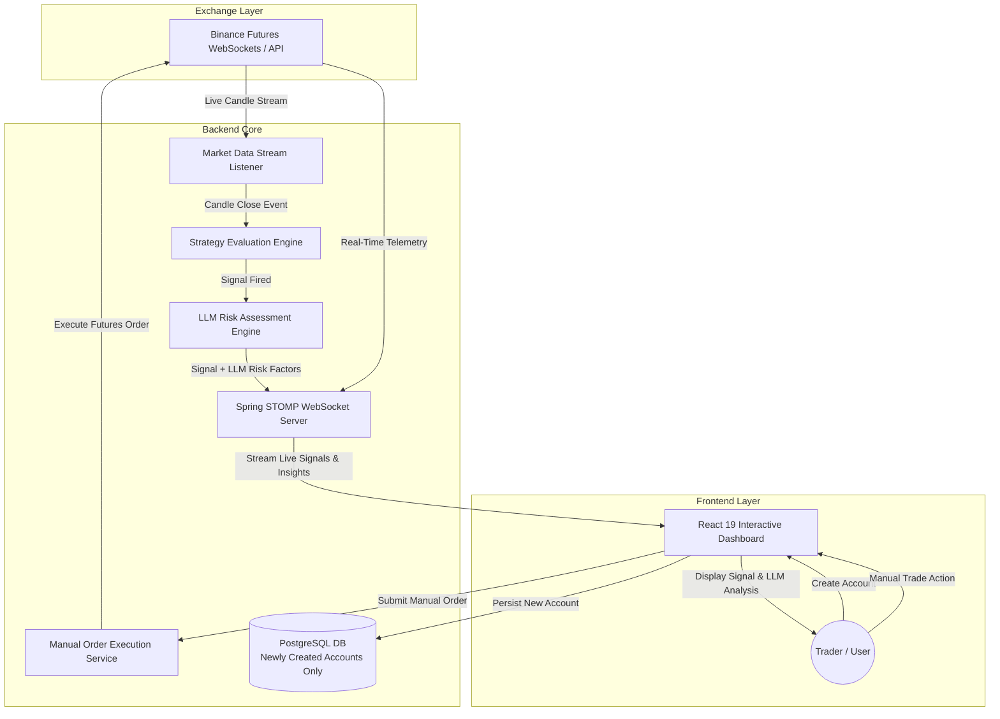

# EasyTrader — Project Overview

## Previews

---

## 1. Summary

**EasyTrader** is an algorithmic trading companion and decision-support platform designed for cryptocurrency futures trading on Binance USDS-M Futures. 

The system continuously monitors top N live candle updates by 24hr volume from exchange market streams and evaluates technical strategy rules upon candle close. When a strategy generates a trading signal, the LLM Module automatically evaluates the signal to produce contextual risk factors and second-guess insights. 

Both the strategy signal and the LLM's risk assessment are pushed to an interactive React frontend dashboard for live user inspection. EasyTrader does NOT automatically execute trades; trade execution is entirely manual, leaving the final trading decision in the user's hands.

---

## 2. Tech Stack

### Backend Services
- **Runtime & Framework**: Java 17, Spring Boot
- **API & Real-time Messaging**: Spring WebMVC, Spring WebSocket with STOMP protocol
- **Data Persistence**: Spring Data JPA with PostgreSQL
- **Exchange Integration**: Binance USDS-M Futures Java SDK
- **Financial Precision**: Decimal4j (for exact numerical arithmetic)

### Frontend Application
- **Core Library & Build Tool**: React 19, Vite
- **UI Architecture & Styling**: Styled-Components
- **Real-Time Communication**: `@stomp/stompjs` over WebSocket
- **UI Notifications & Feedback**: Sonner

---

## 3. High-Level Architecture & Workflow

The architecture consists of three core components: Market Data & Strategy Signal Generation, LLM Risk Assessment, and Manual Trade Execution via the Dashboard.

---

## 4. Core Operational Flow

1. **Account Onboarding**:
   - When a new account is registered or created, the backend saves the new account record to the PostgreSQL database.

2. **Market Data Ingestion**:
   - The backend streams real-time order book and kline (candle) data directly from Binance USDS-M Futures into memory.

3. **Candle Close Signal Generation**:
   - On each candle close, strategy logic evaluates candle data and generates signals when triggers are met.

4. **LLM Risk Assessment ("Second-Guessing")**:
   - On candle close, any generated signal is passed to the LLM module.
   - The LLM does not reject or filter out signals; instead, it generates second-guessing insights, market context, and risk factors associated with the signal.

5. **Frontend Signal & Risk Presentation**:
   - The strategy signal alongside the LLM's risk analysis are broadcast via WebSockets to the React frontend dashboard in real time.

6. **Manual Trade Execution**:
   - The trader reviews the signal and LLM risk assessment on the UI.
   - All trade actions are entirely manual. If the user chooses to trade, the action is routed through the manual order execution engine directly to Binance Futures.

